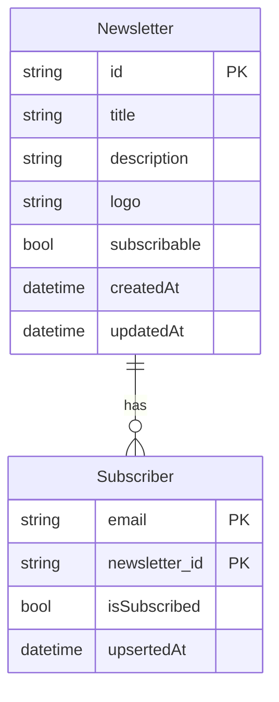

# i365-letter-drop

## How to run

```
npm install
npm run dev
```

```
npm run deploy
```

## Architecture

### API Schema

[swagger](./api.swagger.yml)

### Database Schema


```mermaid
erDiagram
    Newsletter ||--o{ Subscriber : has

    Newsletter {
        string id PK
        string title
        string description 
        string logo
        bool subscribable
        datetime createdAt
        datetime updatedAt
    }

    Subscriber {
        string email PK
        string newsletter_id PK
        bool isSubscribed
        datetime upsertedAt
    }
```
